<div align="center">

<!-- LOGO PLACEHOLDER: replace with docs/assets/logo.png -->


# ⚖️ Lexi AI

### AI-Powered Legal Assistant & Smart Document Comparator

**Understand any contract in minutes — not hours.**

[](https://github.com/your-username/lexi-ai)

[](https://nextjs.org)
[](https://fastapi.tiangolo.com)
[](https://www.typescript.org)
[](https://www.python.org)
[](https://ai.google.dev)
[](https://supabase.com)
[](https://www.langchain.com)
[](https://www.trychroma.com)

[](#-verification)
[](#-license)
[](#-contributing)
[](https://render.com)

</div>

---

## 📖 About

**Lexi AI** is a full-stack AI legal assistant that turns dense, jargon-filled legal documents into clear, actionable insight. Upload a contract and Lexi will:

- 🔍 **Extract every clause** and classify its type and importance
- 🚦 **Score risk** (0–100) per document and per clause, with plain-English rationale
- 💬 **Answer your questions** about the document with grounded, cited answers (RAG)
- ⚖️ **Compare two documents clause-by-clause** and surface exactly what changed and what it means for you

Built as a portfolio-grade showcase of modern full-stack + AI engineering: Next.js 15 App Router, FastAPI, Google Gemini, LangChain, ChromaDB vector search, and Supabase.

---

## 🎯 The Problem

Legal documents are written for lawyers, not for people.

- **76% of consumers** don't read terms-of-service or rental agreements before signing
- Legal review costs **$200–$500/hour** — out of reach for most individuals and small businesses
- Critical clauses (auto-renewal, indemnity, unilateral termination, arbitration) hide in pages of boilerplate
- Comparing two versions of a contract manually is error-prone and slow

> **Lexi AI bridges the gap**: instant, explainable, AI-powered legal insight — in plain language, at zero legal-firm cost.

---

## 🎬 Demo

<!-- DEMO GIF PLACEHOLDERS: record with a tool like Kap / ScreenToGif and drop into docs/demo/ -->

| Demo | Preview |
|---|---|
| Full walkthrough — upload → analyze → chat |  |
| AI risk analysis in action |  |
| Clause-by-clause document comparison |  |
| Chat with your document (RAG) |  |

---

## 📸 Screenshots

<!-- SCREENSHOT PLACEHOLDERS: drop images into docs/screenshots/ with these exact names -->

| | |
|---|---|
| 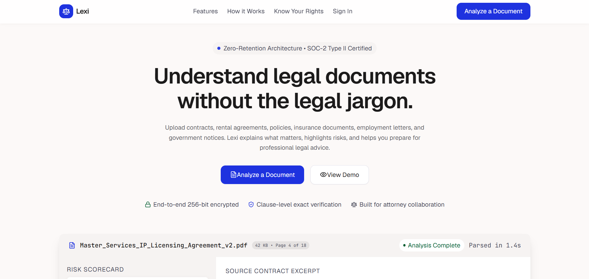 | 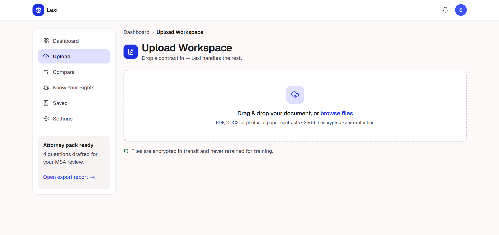 |
| **Landing Page** | **Upload Page** |
| 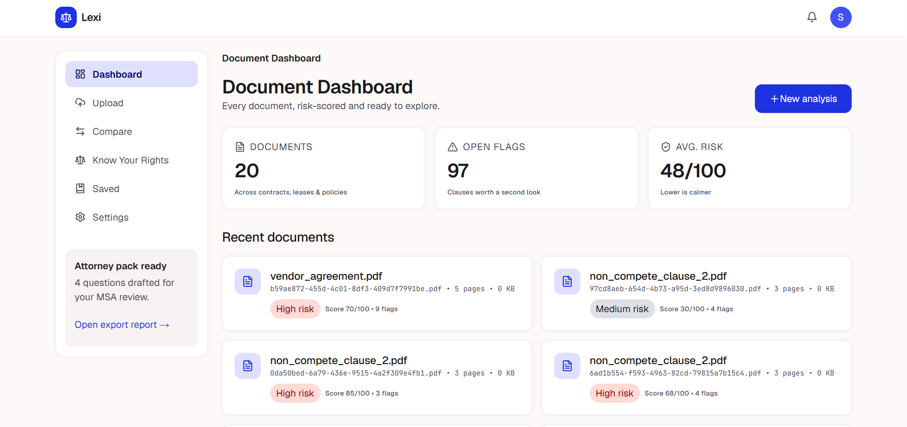 | 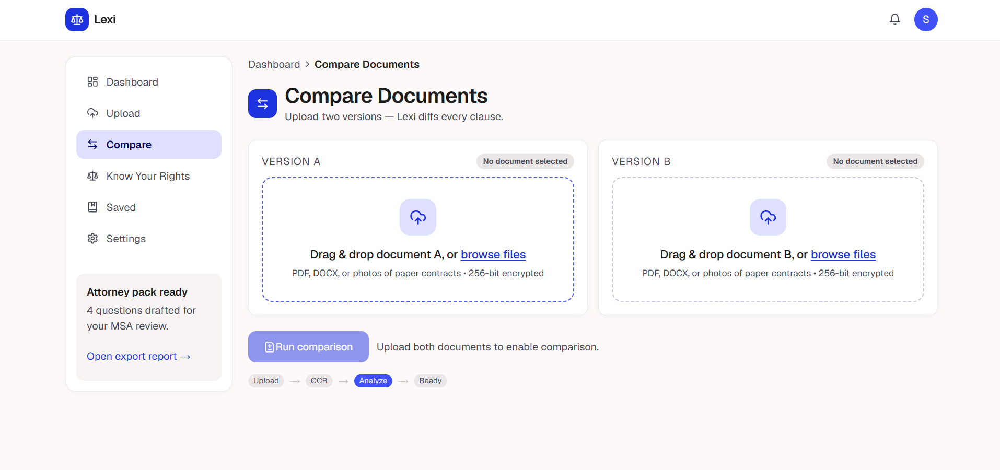 |
| **Dashboard** | **Comparison View** |
| 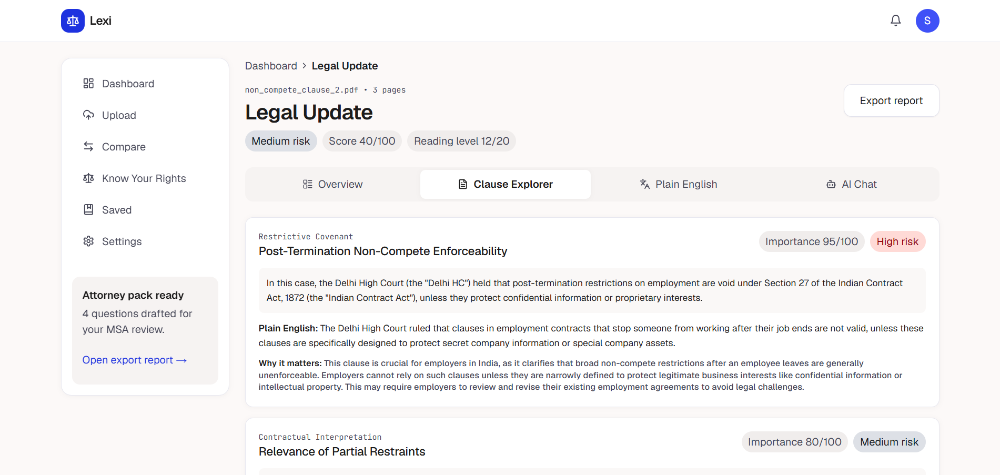 | 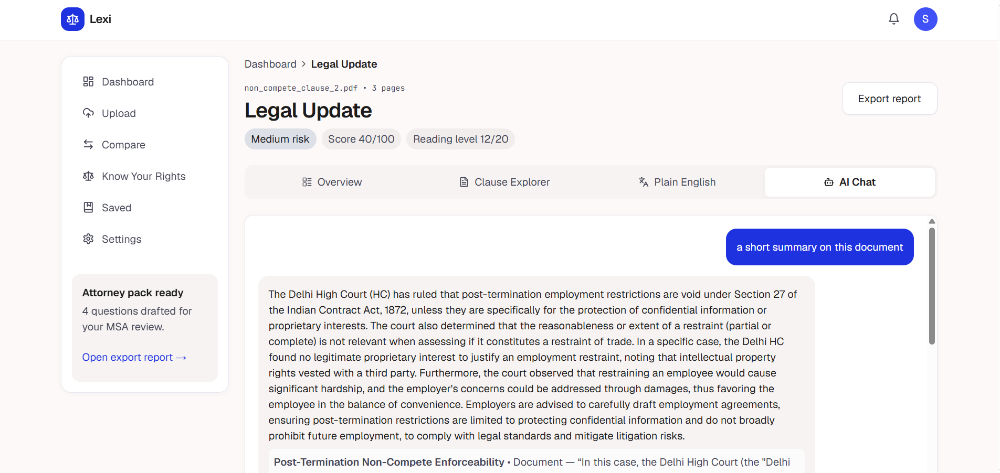 |
| **Analysis View** | **Chat View** |
| 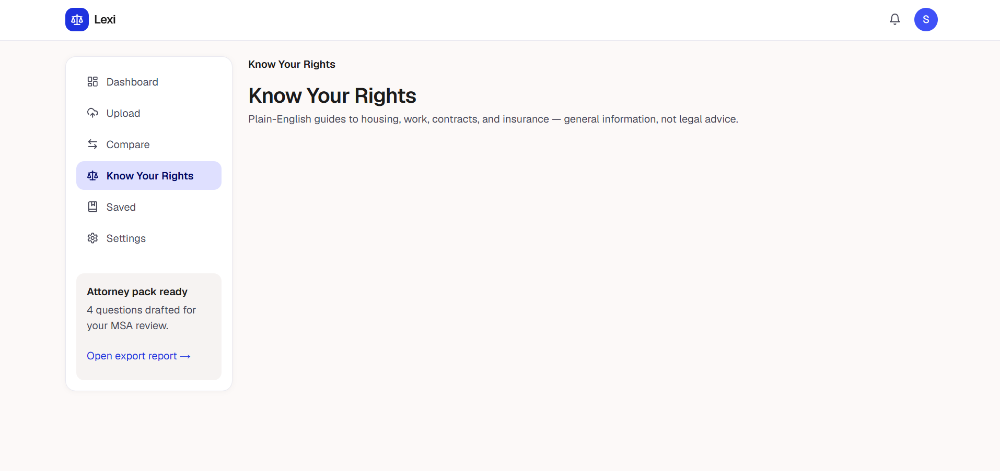 | 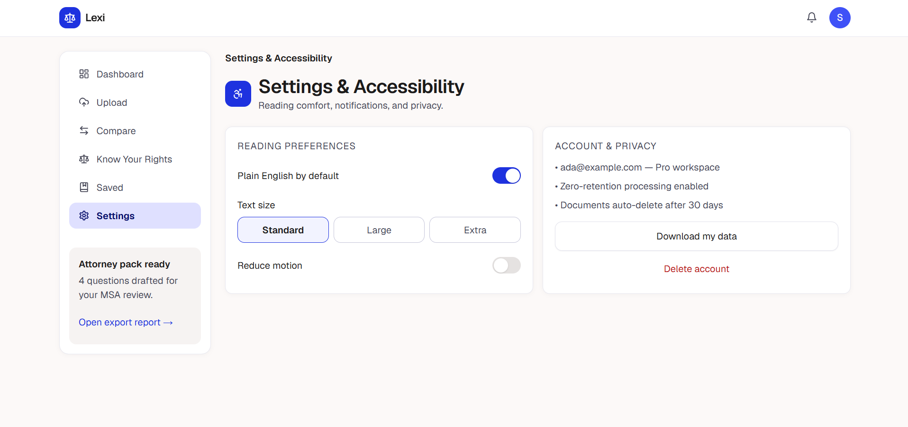 |
| **Rights Assistant** | **Settings** |
|  | |
| **Report Page** | |

<details>
<summary><b>🖼️ Recommended capture specs</b></summary>

- Resolution: **1440×900**, 2× scale, light theme
- Redact any real names, emails, or API keys before committing
- Save as optimized PNG (e.g. `pngquant`) — GitHub caps file size at 100 MB / repo
</details>

---

## 🏗️ Architecture

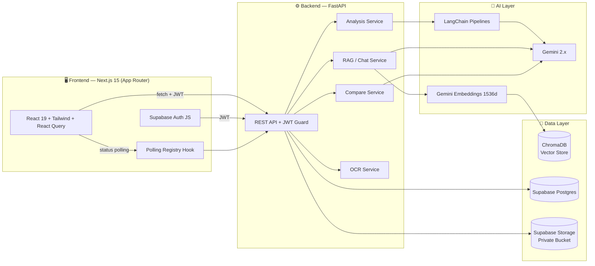

### Component Architecture

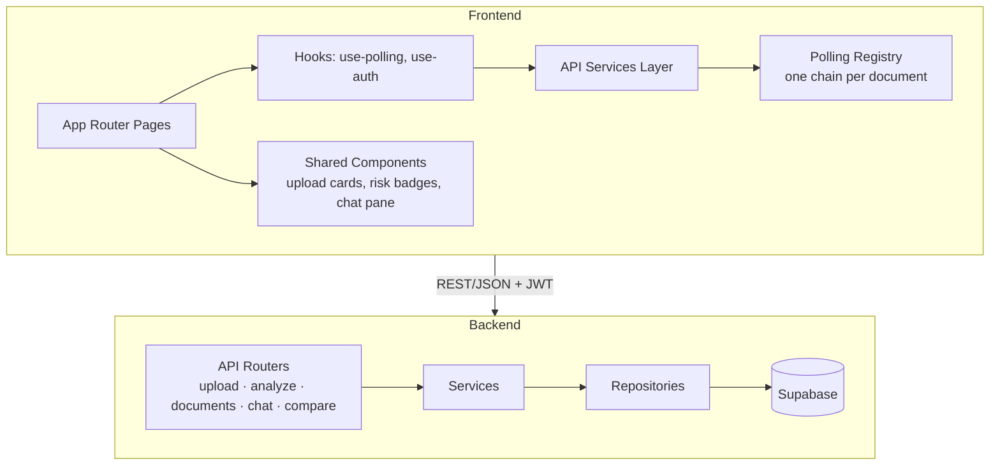

### Database Schema

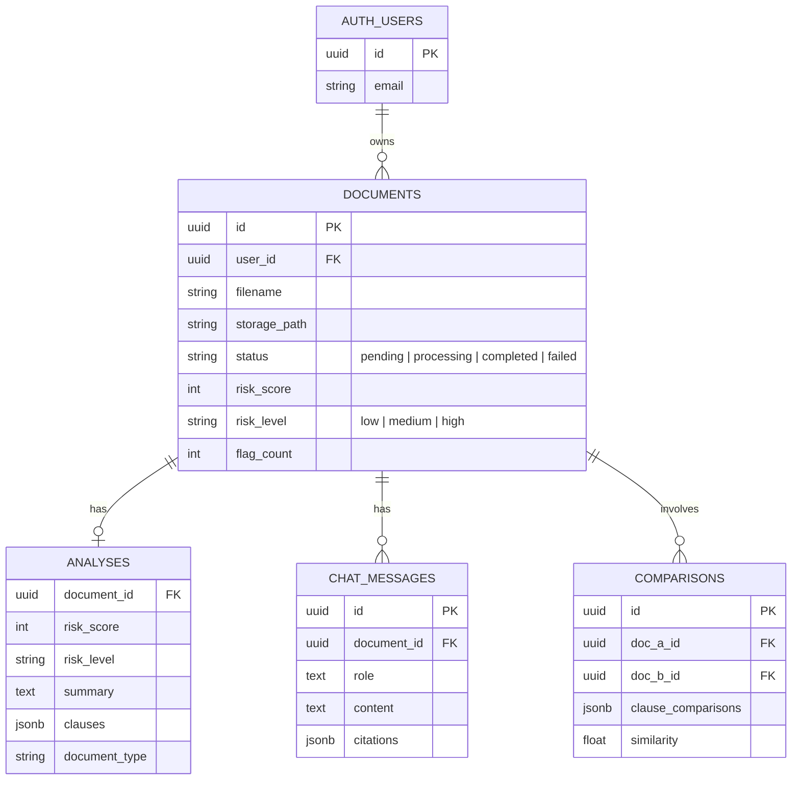

---

## ✨ Features

| Feature | Description | Status |
|---|---|:---:|
| 📄 **Document Upload** | Drag-and-drop PDF/DOCX/image with size & page limits, signed private storage | ✅ |
| 🔍 **OCR Fallback** | Scanned PDFs & images routed through OCR with timeout guard | ✅ |
| 🧩 **Clause Extraction** | Gemini-structured output: type, title, summary, risk per clause | ✅ |
| 🚦 **Risk Analysis** | Document-level 0–100 risk score + low/medium/high clause ratings | ✅ |
| 💬 **Chat with Document** | RAG chat grounded in your document's clauses, with citations | ✅ |
| ⚖️ **Smart Comparison** | Clause-to-clause similarity mapping between two documents | ✅ |
| 🛡️ **Rights Assistant** | Know-your-rights guidance grounded in your jurisdiction | ✅ |
| 📊 **Dashboard** | Filter by risk level, sort by risk score, flag counts at a glance | ✅ |
| 📝 **Report Page** | Exportable analysis report with all clause findings | ✅ |
| 🔐 **JWT Auth** | Supabase Auth with automatic token refresh on the backend boundary | ✅ |
| 🔄 **Resilient Polling** | One polling chain per document, duplicate-proof registry, 401 retry-once | ✅ |
| 🧪 **Tested** | 47 frontend tests: contract, chat & stability regression suites | ✅ |

---

## 🧰 Tech Stack

| Layer | Technology |
|---|---|
| **Frontend** | Next.js 15 (App Router) · React 19 · TypeScript · TailwindCSS · React Query · Framer Motion |
| **Backend** | FastAPI · Python 3.12 · Pydantic v2 · Uvicorn |
| **AI** | Google Gemini · LangChain · Gemini Embeddings (1536-dim) |
| **Vector Store** | ChromaDB (persistent, local) |
| **Auth & Data** | Supabase Auth (JWT) · Supabase Postgres · Supabase Storage |
| **Documents** | PyMuPDF · python-docx · OCR pipeline |
| **Deployment** | Render (frontend Web Service + backend Web Service) |
| **Quality** | ESLint · TypeScript strict · node:test suites · pytest |

---

## 📁 Folder Structure

```
lexi-ai/
├── frontend/                    # Next.js 15 App Router
│   ├── app/                     # Routes: auth, upload, processing,
│   │   │                        # dashboard, compare, chat, rights, report, settings
│   │   ├── api/health/          # Production health proxy → backend /health
│   │   └── api/...              # Route handlers
│   ├── components/              # UI components (compare cards, risk badges…)
│   ├── hooks/                   # use-polling (registry-backed), use-auth
│   ├── lib/                     # polling-registry, supabase client, utils
│   ├── services/                # Typed API clients (upload, analyze, chat)
│   ├── instrumentation.ts       # Windows dev-only EPIPE guard
│   └── scripts/                 # Contract + stability test suites
├── backend/                     # FastAPI
│   ├── app/
│   │   ├── api/                 # Routers: upload, analyze, documents, chat, compare, health
│   │   ├── services/            # analysis, chat, compare, embedding, ocr, storage…
│   │   ├── repositories/        # Supabase data access
│   │   ├── schemas/             # Pydantic strict models (analysis, compare, chat)
│   │   ├── core/                # config, security (JWT), structured logging
│   │   └── main.py              # App factory, CORS, lifespan
│   ├── scripts/                 # reindex CLI, Gemini smoke tests
│   └── tests/                   # pytest regression suites
├── supabase/                    # Migrations & schema
├── docs/
│   ├── assets/                  # Logo
│   ├── screenshots/             # UI screenshots (see placeholders above)
│   └── demo/                    # Demo GIFs
├── reports/                     # Integration verification artifacts
├── docker-compose.yml
└── README.md
```

---

## 🚀 Getting Started

### Prerequisites

- **Node.js ≥ 20** and **npm**
- **Python ≥ 3.12**
- A free [Google AI Studio](https://aistudio.google.com) API key
- A free [Supabase](https://supabase.com) project

### 1. Clone

```bash
git clone https://github.com/your-username/lexi-ai.git
cd lexi-ai
```

### 2. Environment Setup

```bash
# Backend
cp backend/.env.example backend/.env

# Frontend
cp frontend/.env.example frontend/.env.local
```

Fill in the values — see the [Environment Variables](#-environment-variables) table.

### 3. Supabase Setup

1. Create a project at [supabase.com](https://supabase.com)
2. Run the migrations in [`supabase/`](./supabase) via the SQL editor or `supabase db push`
3. Create a **private** storage bucket (e.g. `documents`) with RLS policies restricting reads/writes to the owning user
4. Copy `Project URL`, `anon key`, and `service_role key` from **Settings → API**
5. Enable **Email** auth under **Authentication → Providers**

### 4. Gemini Setup

1. Get a key at [Google AI Studio](https://aistudio.google.com/apikey)
2. Set `GEMINI_API_KEY` in `backend/.env`
3. Optional tuning:
   - `EMBEDDING_OUTPUT_DIMENSIONALITY=1536` (128–3072; 1536 balances cost/quality)

### 5. ChromaDB Setup

ChromaDB persists automatically — no server needed:

- Default path resolves **outside** `backend/` (`.chroma/` at the repo root) so it survives redeploy re-indexing
- To rebuild the index from existing documents:

```bash
cd backend
python -m scripts.reindex_cli
```

### 6. Running Locally

```bash
# Terminal 1 — backend (http://localhost:8000)
cd backend
pip install -r requirements.txt
uvicorn app.main:app --reload

# Terminal 2 — frontend (http://localhost:3000)
cd frontend
npm install
npm run dev
```

Open **http://localhost:3000**, sign up, and upload your first document. Interactive API docs: **http://localhost:8000/docs**

---

## 🌐 API Overview

Base URL: `http://localhost:8000` · All protected routes require `Authorization: Bearer <JWT>`

| Method | Endpoint | Description |
|---|---|---|
| `GET` | `/health` | Liveness & config probe (used by Render + frontend proxy) |
| `POST` | `/upload` | Multipart upload → Supabase Storage + DB record |
| `POST` | `/analyze/{document_id}` | Start Gemini risk analysis (async; poll status) |
| `GET` | `/documents` | List documents — `search`, `risk_level`, sort & pagination |
| `GET` | `/documents/{id}` | Document detail incl. analysis |
| `PATCH` | `/documents/{id}` | Rename / update document type |
| `DELETE` | `/documents/{id}` | Delete document + stored file |
| `GET` | `/documents/{id}/signed-url` | Short-lived private download URL |
| `POST` | `/chat` | Ask a question about a document (RAG) |
| `GET` | `/chat/{document_id}` | Chat history for a document |
| `DELETE` | `/chat/{document_id}` | Clear chat history |
| `POST` | `/compare` | Compare two documents clause-by-clause |
| `GET` | `/compare` | List recent comparisons |

> Full interactive schema at `/docs` (Swagger UI) or `/redoc`.

---

## 🤖 The AI Pipeline

### 1. Ingestion & Extraction

```
Upload → validate (size/pages/type) → Supabase Storage (private)
      → text extraction (PyMuPDF / python-docx)
      → OCR fallback for scanned docs (timeout-guarded)
      → clean & chunk text
```

### 2. Clause Extraction & Risk Analysis

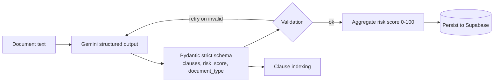

- Each clause gets: **type, title, plain-English summary, risk level + rationale**
- Document risk score aggregates clause severities (clamped 0–100, bucketed low <34 / medium <67 / high)
- Gemini responses are schema-validated and retried — no raw model output reaches the API contract

### 3. RAG Indexing Flow

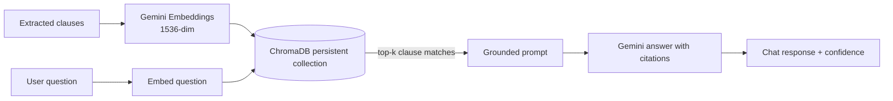

- Analysis triggers clause indexing into ChromaDB (once per document — concurrent chats never re-index)
- Retrieval failures degrade gracefully (empty results, never a crash)
- Chat answers must cite the clauses they used

---

## 🔐 Authentication Flow

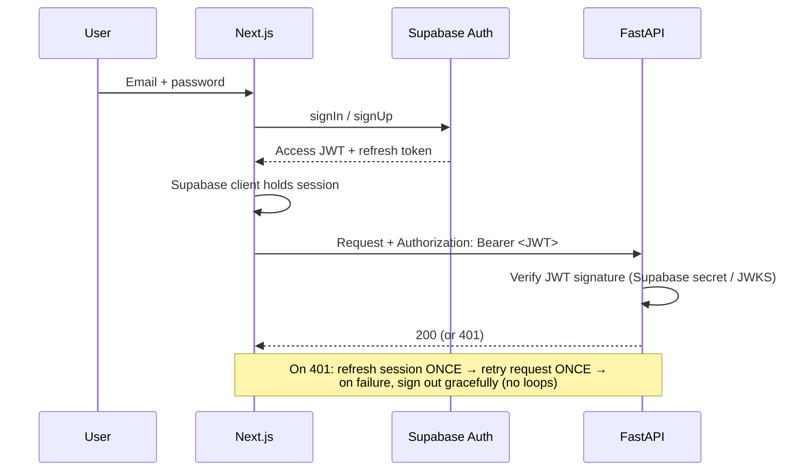

- **Ownership enforced server-side**: every query filters by the JWT's `user_id` — cross-user access returns 404
- `service_role` key is **backend-only**, never exposed to the browser

---

## 🔄 Polling Lifecycle

Analysis is async; the frontend polls status with a **duplicate-proof, terminal-aware** design:

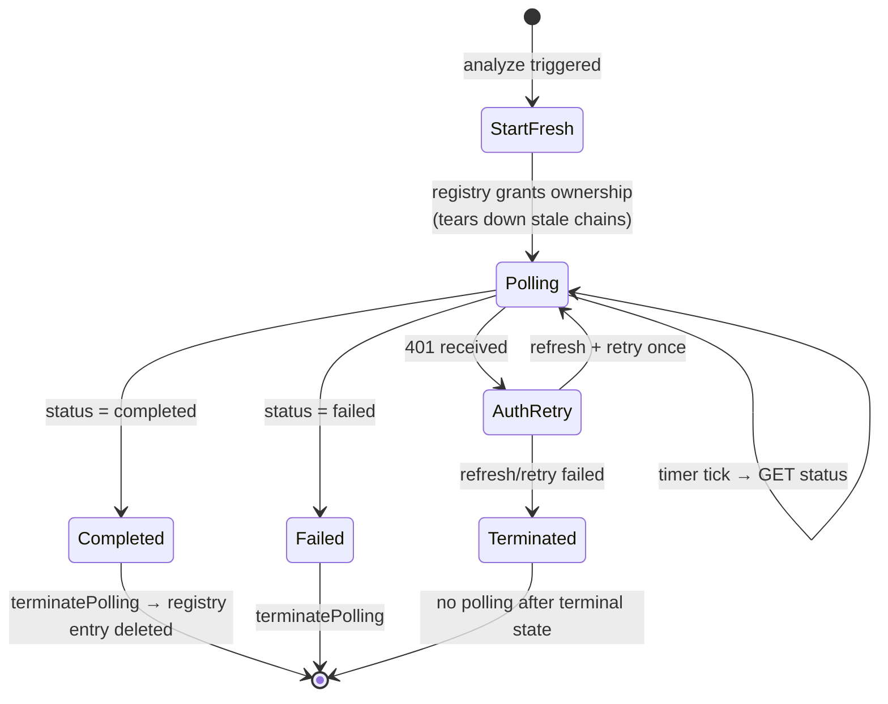

**Guarantees:**

1. **One chain per document** — `startFresh()` rejects duplicates and tears down stale timers
2. **Registry-owned timers** — all timeouts route through `pollingRegistry`, never bare `setInterval`
3. **`terminatePolling()` is permanent** — after terminal state, no further polls until an explicit `startFresh()`
4. **401 → refresh once, retry once** — auth failure terminates cleanly (`auth_failed`), no infinite loops
5. **Once-ref guards** — `analyzeTriggered` + `isAnalysisInFlight` refs prevent double-triggered analyses

---

## 🛠️ Deployment (Render)

Deploy frontend and backend as **two separate Web Services**.

### Backend — FastAPI Web Service

| Setting | Value |
|---|---|
| **Type** | Web Service |
| **Runtime** | Python 3 |
| **Root Directory** | `backend` |
| **Build Command** | `pip install -r requirements.txt` |
| **Start Command** | `uvicorn app.main:app --host 0.0.0.0 --port $PORT` |
| **Health Check Path** | `/health` |

> ⚠️ **PORT binding**: Render injects `$PORT` — Uvicorn **must** bind to `0.0.0.0:$PORT` (hardcoding `8000` will fail the health check and the deploy).

**Backend env vars:** `GEMINI_API_KEY`, `SUPABASE_URL`, `SUPABASE_ANON_KEY`, `SUPABASE_SERVICE_ROLE_KEY`, `ENVIRONMENT=production`, `DEBUG=false`

> 💡 On Render's free tier the local disk is **ephemeral** — ChromaDB re-indexes from Supabase on cold start (see ChromaDB setup above).

### Frontend — Next.js Web Service

| Setting | Value |
|---|---|
| **Type** | Web Service |
| **Runtime** | Node |
| **Root Directory** | `frontend` |
| **Build Command** | `npm install && npm run build` |
| **Start Command** | `npm run start` (Next.js binds `0.0.0.0:$PORT` automatically) |
| **Health Check Path** | `/api/health` |

The `/api/health` route is a **pure 5s-timeout proxy** to the backend `/health` — it returns the backend's status unchanged, and `502` only when the backend is unreachable. This keeps Render's health check green even during backend cold starts… only after the backend is actually up.

**Frontend env vars:** `NEXT_PUBLIC_API_URL=https://<your-backend>.onrender.com`, `NEXT_PUBLIC_SUPABASE_URL`, `NEXT_PUBLIC_SUPABASE_ANON_KEY`

### Recommended order

1. Deploy **backend first**, confirm `/health` returns 200
2. Deploy **frontend** with `NEXT_PUBLIC_API_URL` pointing at the backend URL
3. (Optional) Set up a Render **Cron Job** or uptime pinger to mitigate free-tier spin-down

---

## 🔐 Environment Variables

### Backend (`backend/.env`)

| Variable | Required | Default | Description |
|---|:---:|---|---|
| `GEMINI_API_KEY` | ✅ | — | Google AI Studio API key |
| `SUPABASE_URL` | ✅ | — | Supabase project URL |
| `SUPABASE_ANON_KEY` | ✅ | — | Supabase anon key |
| `SUPABASE_SERVICE_ROLE_KEY` | ✅ | — | Backend-only service key (**never** expose client-side) |
| `ENVIRONMENT` | — | `development` | `development` / `staging` / `production` |
| `DEBUG` | — | `false` | Enables verbose logging |
| `EMBEDDING_OUTPUT_DIMENSIONALITY` | — | `1536` | Embedding dimensionality (128–3072) |
| `MAX_PDF_PAGES` | — | `100` | Upload page limit |
| `MAX_EXTRACTED_CHARACTERS` | — | `300000` | Extraction size cap |
| `OCR_TIMEOUT_SECONDS` | — | `30.0` | OCR request timeout |

### Frontend (`frontend/.env.local`)

| Variable | Required | Default | Description |
|---|:---:|---|---|
| `NEXT_PUBLIC_API_URL` | ✅ | `http://localhost:8000` | Backend base URL |
| `NEXT_PUBLIC_SUPABASE_URL` | ✅ | — | Supabase project URL |
| `NEXT_PUBLIC_SUPABASE_ANON_KEY` | ✅ | — | Supabase anon (public) key |

---

## 🛡️ Security

- 🔑 **JWT verification on every protected route** — signature checked server-side against Supabase
- 🧱 **Row-level ownership** — every DB query filters by the authenticated `user_id`; cross-user access returns 404 (not 403 — no existence leaks)
- 🗄️ **Private storage bucket** — files only reachable via short-lived signed URLs scoped to the owner
- 🚫 **`service_role` key never leaves the backend** — the browser only ever holds the anon key
- 🧾 **Strict Pydantic schemas** (`StrictModel`) — no raw model output trusted at API boundaries; invalid Gemini responses are retried/rejected
- 🛡️ **Prompt-injection hardening** — chat prompts ground the model in retrieved clauses and resist instruction smuggling from document text
- 🚦 **Rate-friendly uploads** — size/page/character limits with clear 4xx messaging
- 🔍 **Secrets hygiene** — all keys via env vars; `.env*` gitignored; integration reports redact values

## ⚡ Performance

- 📦 **`optimizePackageImports`** for heavy barrels (`lucide-react`, `framer-motion`) — per-route compile weight trimmed
- 🧩 **React Query** caching with in-flight de-duplication — no duplicate network calls
- 🔄 **Registry-backed polling** — single timer chain per document; terminal states stop all timers
- 🖼️ **Static favicon route** (`app/icon.svg`) — prevents accidental `/_not-found` compilation on navigation
- 🪟 **Dev-stability hardening** — EPIPE suppression + webpack watch excludes for logs/`.chroma`/secrets churn
- ⏱️ **5s health proxy timeout** — health checks fail fast instead of hanging deploy pipelines
- 🧠 **Embed-once retrieval** — clauses are indexed into ChromaDB once; concurrent chats share the collection
- 📉 **Structured logging** with levels — dev verbosity never ships to production

---

## 🗺️ Roadmap

- [ ] 📑 DOCX & multi-format export of analysis reports (PDF export)
- [ ] 🌍 Multi-language document support & localized rights guidance
- [ ] 🧑‍⚖️ Clause playbook library — flag deviations from standard templates
- [ ] 🤝 Real-time collaborative review & comments
- [ ] 🔔 Webhook/email notifications when long-running analyses finish
- [ ] 📱 PWA / mobile layout polish
- [ ] 🔗 Public read-only share links with expiry
- [ ] 🧪 Playwright end-to-end suite over authenticated flows

## 🤝 Contributing

Contributions are welcome!

```bash
# 1. Fork & branch
git checkout -b feat/my-feature

# 2. Make changes, then verify
cd frontend && npm run lint && npm run typecheck && npm test
cd backend  && python -m compileall app && pytest

# 3. Open a PR with a clear description
```

- Keep PRs focused; match existing code style
- Add/adjust tests for behavior changes
- Do not commit secrets or `.env` files

## 📜 License

Distributed under the **MIT License**. See [`LICENSE`](./LICENSE) for details.

## 👤 Author

<div align="center">

<!-- Replace with your handle & links -->
**Your Name** — *Full-Stack & AI Engineer*

[](https://github.com/your-username)
[](https://www.linkedin.com/in/your-profile)
[](https://your-portfolio.dev)

⭐ Star this repo if Lexi AI helped you understand your contracts!

</div>

---

<details>
<summary><b>❓ FAQ</b></summary>

**Is Lexi AI a replacement for a lawyer?**
No. Lexi AI is an educational and productivity tool. It highlights and explains clauses — it does not provide legal advice. Always consult a licensed attorney for decisions that matter.

**Which documents are supported?**
PDF (native + scanned via OCR), DOCX, and common image formats, subject to page/size limits.

**Where is my data stored?**
Documents live in a private Supabase Storage bucket; analysis and chat history in Supabase Postgres; vector embeddings in a local ChromaDB collection. Nothing is shared across users.

**Which Gemini models are used?**
A Gemini 2.x model handles clause extraction, risk analysis, comparison, and chat; Gemini embedding models power RAG retrieval. The provider is abstracted in `gemini_provider.py`, so models are swappable.

**Why ChromaDB instead of pgvector?**
For this project size, ChromaDB's persistent local collection is zero-ops and fast. The embedding service is isolated, so swapping to pgvector later is a contained change.

**Why does analysis take a while?**
Risk analysis runs structured-output generation over every clause plus validation retries. The frontend polls a registry-backed status endpoint — you can close the page and come back.

**Can I self-host without Supabase?**
The auth/storage/postgres layers assume Supabase today. The repositories are isolated, so alternative backends (e.g. Postgres + your own JWT) are feasible but require adapter work.

</details>

---

<div align="center">
<sub>Built with ⚖️ + ☕ — Lexi AI</sub>
</div>
